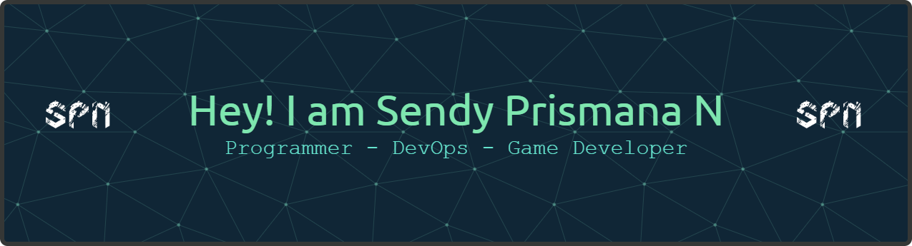

<!--  -->

<h1 align="center">Hello World  I'm Sendy Prismana 
<h2 align="center">A passionate developer from Indonesia👌🏻</h2>
</a>
<!-- ## Hello World I'm Sendy Prismana Nurferian👋 -->
<h3 align="left">
<!--   <a href="https://github.com/DenverCoder1/readme-typing-svg"> -->
</a>
</h3>

  

###

  
  
  
  
  
  

 

<!-- 🔭 I’m currently working on **Institute Of Technology Sepuluh Nopember** -->

<!-- 🌱 I’m currently learning **Python, Golang, DevOps** -->

<!-- 👯 I’m looking to collaborate on Any Companies for WFO or WFH/Remote Work -->

<!-- - 💬 Ask me about Programs -->

<!-- 📫 How to reach me: On My Instagram and Email -->

<!-- 😄 Pronouns: Him/Her -->

<!-- - ⚡ Fun fact: I'm a old twinks brother -->

#### 💻 Tech Stack:
                                                                        

#### 🤖 Artificial Intelligence
       

#### 📊 GitHub Stats:
 
 

<!-- #### 🏆 GitHub Trophies
 -->

### 🔝 Top Contributed Repo

---

<!-- Proudly created with GPRM ( https://gprm.itsvg.in )  -->

#### 🎓 Education
      

<!-- #### ⚠️ Workspace Specs - Workflow Platforms
  -->

###

 

###

 

### Spotify Playing 🎧

 