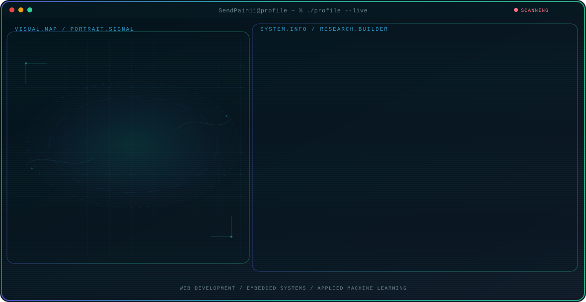

<!-- Generated by GitHub Profile Agent Console. Edit profile.config.json, then run npm run generate. -->

  <picture>
    <source media="(max-width: 760px) and (prefers-color-scheme: dark)" srcset="./assets/hero/agent-console-35f02568-mobile-dark.svg">
    <source media="(max-width: 760px)" srcset="./assets/hero/agent-console-35f02568-mobile-light.svg">
    <source media="(prefers-color-scheme: dark)" srcset="./assets/hero/agent-console-35f02568-dark.svg">
    <source media="(prefers-color-scheme: light)" srcset="./assets/hero/agent-console-35f02568-light.svg">
    
  </picture>

  
  
  
  

## About Me

I'm a Network Infrastructure Engineer at RSUD Syarifah Ambami Rato Ebu, and a Computer Engineering graduate of ITS. I enjoy building full-stack web applications, experimenting with embedded systems, and exploring practical machine learning.

I like turning real-world problems into working software, from network systems to scraping, dashboards, and Arduino simulations, and learning the tools along the way.

## Current Focus

| Area | What I am exploring |
| --- | --- |
| **Web Development** | Full-stack apps with REST APIs, dashboards, and data-driven features. |
| **Embedded Systems** | Arduino and IoT projects, from prototyping to simulation. |
| **Applied Machine Learning** | Exploring practical ML and computer vision use cases with Python. |

## Featured Work

| Project | Focus | Why it matters |
| --- | --- | --- |
| [**Price Tracker**](https://github.com/SendPain11/ecommerce-price-tracker-using-python) | Full-stack Python web app | Tracks product prices across e-commerce platforms using web scraping, a REST API backend, and an interactive dashboard. |
| [**Wokwi Simulator**](https://github.com/SendPain11/Wokwi-Projects-Simulator) | Arduino & embedded systems | A collection of Arduino projects simulated and tested with Wokwi. |

## Research Direction

I care about building working systems end to end, whether that is a web app with a real backend, a simulated embedded circuit, or a small ML experiment, and learning by shipping.

## Tech Stack

`Python` · `JavaScript` · `TypeScript` · `C++` · `React` · `Next.js` · `FastAPI` · `Flask` · `MySQL` · `PostgreSQL` · `TensorFlow` · `Git`

## Recent Activity

<!-- AUTO:ACTIVITY:START -->
- Aug 24, 2026: pushed 1 commit to [SendPain11/modul-anak-coding](https://github.com/SendPain11/modul-anak-coding).
- Aug 24, 2026: merged pull request [#1](https://github.com/SendPain11/modul-anak-coding) in [SendPain11/modul-anak-coding](https://github.com/SendPain11/modul-anak-coding).
- Aug 24, 2026: opened pull request [#1](https://github.com/SendPain11/modul-anak-coding) in [SendPain11/modul-anak-coding](https://github.com/SendPain11/modul-anak-coding).
- Aug 24, 2026: created a branch in [SendPain11/modul-anak-coding](https://github.com/SendPain11/modul-anak-coding).
- Aug 23, 2026: pushed 1 commit to [SendPain11/modul-anak-coding](https://github.com/SendPain11/modul-anak-coding).
- Aug 23, 2026: pushed 1 commit to [SendPain11/SendPain11](https://github.com/SendPain11/SendPain11).
<!-- AUTO:ACTIVITY:END -->

## Contribution Snake

<picture>
  <source media="(prefers-color-scheme: dark)" srcset="https://raw.githubusercontent.com/SendPain11/SendPain11/output/github-contribution-grid-snake-dark.svg">
  <source media="(prefers-color-scheme: light)" srcset="https://raw.githubusercontent.com/SendPain11/SendPain11/output/github-contribution-grid-snake.svg">
  
</picture>

---

  Building practical projects and learning by shipping.

